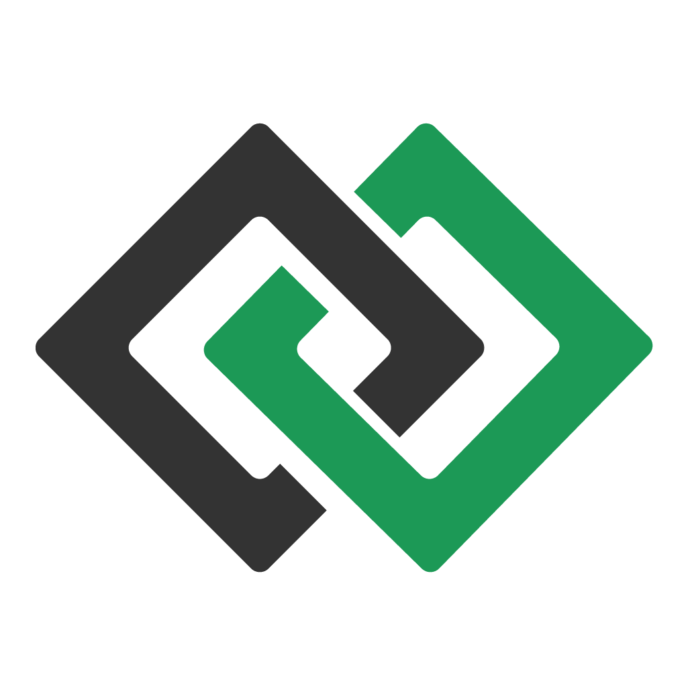

<div align="center">
  
</div>

<div align="center" >
  <h1>Desafio frontend - Nodis</h1>
  <h3>Aplicação para listar produtos de uma api.</h3>
</div>

## :rocket: Tecnologias utilizadas

- [React](https://github.com/facebook/react)
- React Hooks
- [Redux](https://github.com/reduxjs/redux)

## Estilização

[](https://github.com/styled-components/styled-components)

## Execução

```
yarn
yarn start
```

#### Feito por Alan Costa, com muita determinação e foco! 💜
